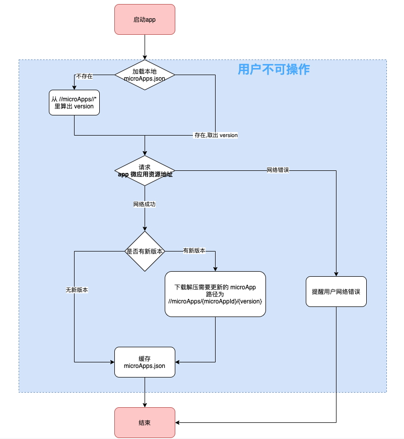

## 部署形式

- 支持无逻辑部署, 也就是直接扔到资源服务器下即可.  
- 支持带逻辑部署
  - 将根据权限是否返回更新包
  - 支持灰度发布更新包


## 客户端更新流程图




## 微应用存储的位置

各平台表现不一, 假设可持久化存储位置为 X

```
{X}/microApps/{microAppId}/{version}/index.html

{X}/microApps/{microAppId}/{version}/icon.png

{X}/microApps/{microAppId}/{version}/...
```


microApps 做为一个统一的 microApp 入口.

```
- {X}
	- microApps
		-	com.zkty.xiaoqu.opendoor.1
				- index.html
				- icon.png
		- com.zkty.xiaoqu.opendoor.2
				- index.html
				- icon.png
		-	com.zkty.xiaoqu.shequ.1
				- index.html
				- icon.png
```


## zip 包格式

```
- {microAppId}.{version}.zip
  - index.html
  - icon.png   // 128*128
  - ...
```

举例:

``` json
- com.zkty.xiaoqu.opendoor.1.zip
  - index.html
  - icon.png
	- ...
```


## version 定义

version = microApp 所有 version的数字之和. 

当本地 version 不能从配置文件读取到时, 客户端应该根据初始打包的微应用自己算出来.

## 引擎应用配置

xengine_config.json:

``` json
{
  "appId": "com.zkty.xiaoqu",    // 建议直接设置为应用的 Bundle Identifier
  "appSecret": "8b387ca3ebdd412e9c97ef81ed352ee7",  //随机 md5 值.
  "offlineServerUrl": "https://3rd-public-file.oss-cn-beijing.aliyuncs.com"  //服务器地址,
  ...
}
```

 

## app 微应用集合地址

请求地址:

```
GET: {offlineServerUrl}/app/{appId}/microApps.json?key=md5(appSecret+appId)&version=12
```


```
key 由  md5 算出. 
key = md5(appSecret+appId)
```

返回: 有新版本

```
http status: 200
```

microApps.json:

``` json
{
  "code":0,
  "version":3,     // microApps.json 版本标识
  "forceUpdate" true,  // 是否强制更新
  "data":
        [
          {
            "microAppName":"开门",
            "microAppId":"com.zkty.xiaoqu.opendoor",
            "microAppVersion":2
          },
          {
            "microAppName":"物业",
            "microAppId":"com.zkty.xiaoqu.realstate"
            "microAppVersion":1
          }
        ]
  }
```


没新版本:

http status: 200

``` json
{
  "code":304,
  "version":1,
 
  }
```

 

> microApps.json 应该持久化在手机应用本地. 用来对比. 
>
> 如果不持久化到本地, 那就需要扫描本地 microApps 来对比是否需要更新版本.


打开微应用

```
xEngine.showMicroApp({microAppId},{version},{args},{microAppName})
```


## 微应用 zip 下载地址
```
GET: {offlineServerUrl}/app/{appId}/{microAppId}.{version}.zip?key=md5(appSecret+microAppId+version)&engine_build=1

```

返回: zip 包

示例:

http://192.168.3.129:8000/app/com.zkty.xiaoqu/com.zkty.xiaoqu.opendoor.1.zip?key=1f2414c23a7d55dddc11caa32a8e9a4a&engine_build=1

 

engine_build 为引擎 build 号. 由引擎 sdk 暴露获取方法. engine_build 为一个数字.


https://nativesupport.dcloud.net.cn/UniMPDocs/UseSdk/ios
