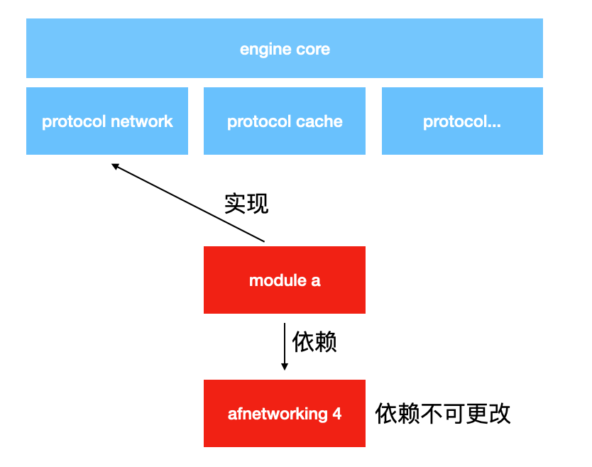

**engine**

引擎是一个特别的组件,其他所有组件都需要依赖于它. 

引擎的工作：

- 组件的发现与编排。
- 组件生命周期的管理与通知。
- 组件的注入。

>  要注意：组件不要依赖组件， 组件应该依赖于 protocol。这样，才可以使组件具有一定的独立性。

引擎中定义了可能会造成冲突的模块它们的 protocol。

如上例中， 当冲突发生时，如果依赖的库不可更改，只需在 module a 实现 protocol network，则可实现 afnetworking 3 到 4 的无缝迁移。

# h5

# iOS

# android

