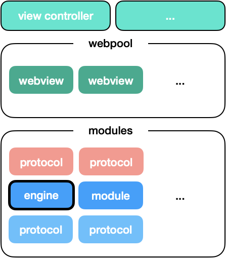
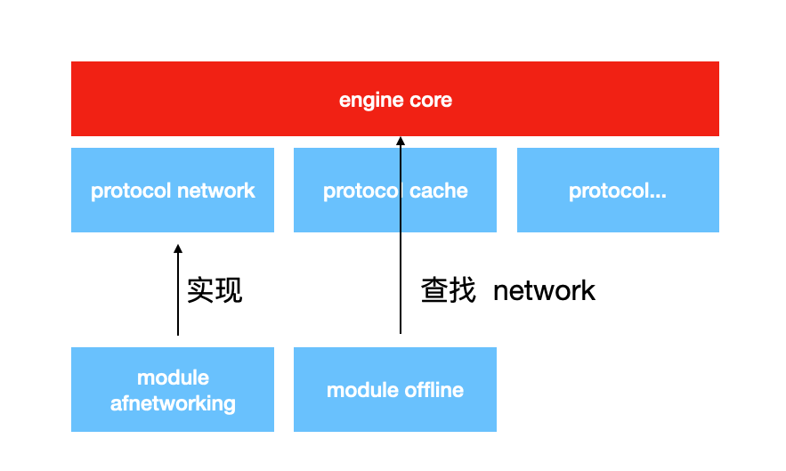
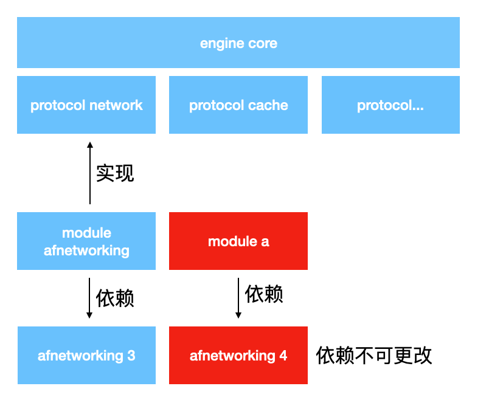

引擎是一个特别的组件,其他所有组件都需要依赖于它.  




java 模块加载逻辑

- 所有模块都放在 com.zkty.modules.loaded 包下
- 扫描  com.zkty.modules.loaded 包下所有类, 
  - 如果类继承自  xengine__module_BaseModule, 则认为是 模块类, 加入 modules 
    - 实例化, 并跟踪特殊接口类
  - 如果没继承,跳过
- 遍历 modules, 调用  xengine__module_BaseModule::onAllMoudlesInited;


modules 可响应系统事件(app生命周期,消息事件,等):  模块类必须实现相应接口

- 在系统事件发生的地方,通过 engine 
  - 遍历 modules, 调用相应生命周期接口


webview容器数据结构(PoolingList):

```
  PoolingList.m

  current
  |
  * -> * -> *

       current
       |         auto expand
  * -> * -> * -> [*] -> [*]

```


webview容器接口(PoolingList):

``` oc
class PoolingList{
  private int current_idx ;

  public void forward();
  public void backward();
  public Object peekCurrent();
  public void add(Object object);

  public int getCurrentInex();
  public int getCount();
  public void shrinkToSize(int size);
}
```


浏览器池初始化逻辑

- 创建 WebViewPool 单例

- 预先加入 3 个 webview 实例

- 在推入 UIController/Activity 时, WebViewPool.getUnusedWebViewFromPool 取出未使用的 webview 实例

  -  如果未使用 webview 小于 2,  增加 webview 到 pool 里.
  -  未使用的 webview 超过了 5 个, 且计数超过 3 次都超过 5 个, 将 webview 置为 current+3 个

- 在 UIController/Activity 被销毁时,  WebViewPool.putbackWebViewIntoPool 放回 webview (放回当前 current_webview)

  


WebViewPool 类与成员函数:

```
public class WebViewPool {
	static WebViewPool sharedInstance();
	webview peekNextUnusedWebViewFromPool();
	webview getUnusedWebViewFromPool();
	void  putbackWebViewIntoPool();
}
```


RecycleViewController:

``` oc
- initWithUrl:(string) fileUrl;
- (void) preRenderUrl:(string)url toController:(UIViewController*) parentVC;
XEngineWebView * webview;
```


引擎的工作：

- 组件的发现与编排。
- 组件生命周期的管理与通知。
- 组件的注入。

>  要注意：组件不要依赖组件， 组件应该依赖于 protocol。这样，才可以使组件具有一定的独立性。




引擎中定义了可能会造成冲突的模块它们的 protocol。



如上例中， 当冲突发生时，如果依赖的库不可更改，只需在 module a 实现 protocol network，则可实现 afnetworking 3 到 4 的无缝迁移。


# api


# iOS


# android


