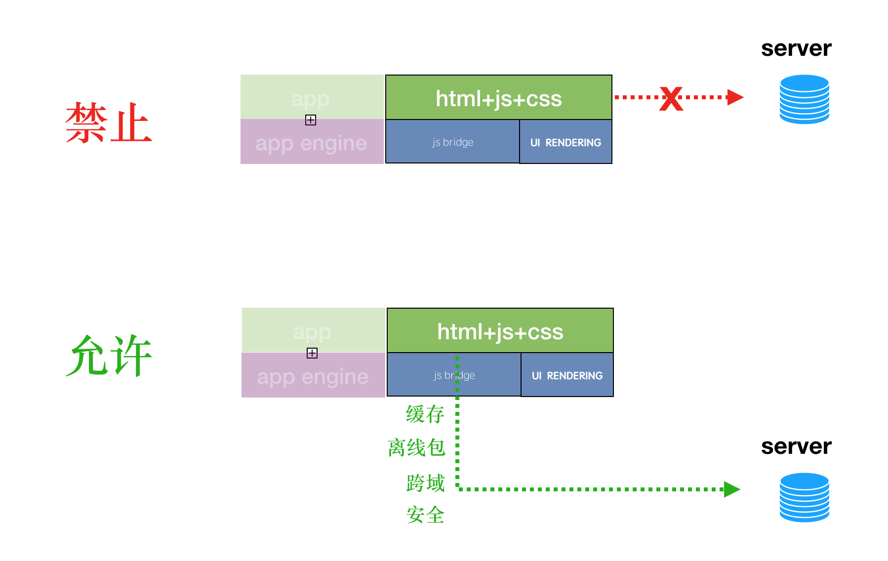

# 统一网络

网络是除缓存外最核心的一块功能. 

需要将 h5 的网络统一由 native 做一层代理, 来解决 cookie 共享, 安全, 跨域, 缓存, 路由等问题.

浏览器本身自带的网络请求功能, 只做加载第三方链接的标签资源用. 要达到如微信小程序的感觉, 可直接屏蔽.

其他请求全必须走本地网络.

方案会基于异步封装 native 网络请求.



**白名单**

统一网络出口要设白名单， 防止xss。

白名单配置在服务器上。在下载离线包时，读入配置。

配置做签名，防止篡改。 统一网络


# api

## request

- 发起网络请求

- 函数声明

  - network.request(Object)

    

- Object参数说明

| 参数名  | 类型     | 必填 | 默认值 |        说明        |
| ------- | -------- | ---- | :----: | :----------------: |
| url     | String   | 是   |        |   服务器接口地址   |
| data    | Object   | 否   |        |     请求的参数     |
| header  | Object   | 否   |        |     请求头         |
| method  | String   | 否   |  GET   |      GET/POST      |
| timeout | Number   | 否   | 30000  |  超时时间, 单位ms  |
| success | Function | 否   |        | 成功返回的回调函数 |
| fail    | Function | 否   |        | 失败返回的回调函数 |

- object.success回调方法

| 参数名   | 类型     | 必填 |        说明        |
| -------  | -------- | ---- | :----------------: |
| statusCode | Number   | 是   |  http返回状态码   |
| data    | Object   | 是   |  服务器返回内容  |

- data 数据说明
  - 最终发送给移动端(iOS, Android)的数据是 String 类型，如果传入的 data 不是 String 类型，会被转换成 String。
  - 转换规则`JSON.stringify(data)`。
  - 移动端(iOS, Android)会在接收到数据时对data进行序列化。  


-  示例

```javascript
// 回调发送网络请求
xengine.network.request({
  url: 'http://127.0.0.1:8000/data1.json', // 仅为示例, 实际以接口为准
  method: 'GET',
  data: {
    text: 'Hello,x-engine'
  },
  success: (res) => {
  	console.log(res);
	},
  fail: (error) => {
    console.log(error);
  }
});
```

```javascript
// async 、await 方式发送网络请求
async function request() {
  const params = {
    url: 'http://127.0.0.1:8000/data1.json', // 仅为示例, 以实际开发接口为准
    method: 'GET'
  }
  const result = await xengine.network.request();
  console.log(result);
}
```


- 支持平台
  - iOS, Android


# iOS


# android


