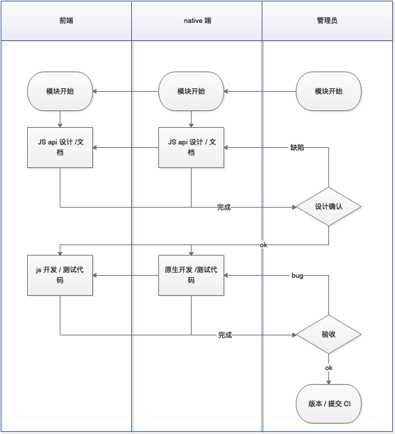
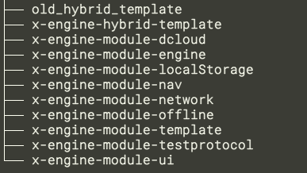
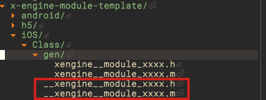

# 模块开发




 

## 流程

xegine 所有相关的模块与应用应放在统一文件夹下。

如 mdoules 下：




### 手动创建

```bash
# 初始化： 安装 coge
pip3 install coge

# 初始化 安装 x-cli 
git clone https://github.com/zkty-team/x-engine-api-generator
make install

# 创建 modules 文件夹
mkdir modules && cd modules 

# 克隆远程模板到本地 modules 文件夹
git clone https://www.github.com/zkty-team/x-engine-module-template

# 制作 coge 模板镜像
cd x-engine-module-template  && coge -r 

# 以模板镜像生成工程
cd moduels  && coge x-engine-module-template xxxx:camera @:x-engine-module-camera -w

# iOS 开发
cd iOS && pod install
```


### x-cli 创建

```
x-cli module init com.zkty.module.camera   //. 会转换成文件夹使用的 - 
```

// TODO 开发中，见 [模块-工具.md](模块-工具.md) 


*禁止使用大写!*

工程好后， 你的第一件事就是编写 model.ts ， 见  [模块-开发.md](模块-开发.md)  model.ts 帮助。

生成相应的接口。

#### iOS

 会生成在 gen 文件夹， 

你只需要继承生成的 m 文件，将类名前加两个`_` 就实现了自动发现并注册模块。




在 `__xengine__module_xxxx.m` 里右键生成未实现的接口文件，所以的待实现的方法，与参数都将自动生成。


#### java

java 类似。


#### h5

会自动生成测试文件。详见  [模块-工具.md](模块-工具.md) 


### 发布

必须 加入 npmjs 的开发组,  https://www.npmjs.com/settings/zkty-team/members , 向管理员申请.

```
npm publish --access public
```

