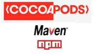

打包好的组件存在于各私有发布仓库, 如 npm , cocoapods , Neuxs(Mavem).




## 集成流程
以蓝牙组件为例.

module.json

```
{
  "module_id":"com.zkty.bluetooth", 
  "name":"蓝牙",
  "tag": "1.0.0",
  "engine_version": "0.0.1",
  "mini_platform":{
		"ios": "11.1.0",
  	"android_api": 20,
	},
	"exclude_brand":[
    {
      "brand":"华为",
      "device""荣耀10"
    }
  ]
}
```


从组件仓库里找到相应组件, 将module_id, 和 version 写入以下位置


Podfile:
  ```
TODO:
  ```
 gradle.properties:

  ```
TODO:
  ```
  package.json:
  ```
 TODO: 
 dev:{
    ""
  }
  ```

从私库里拉取各自的包.

在

