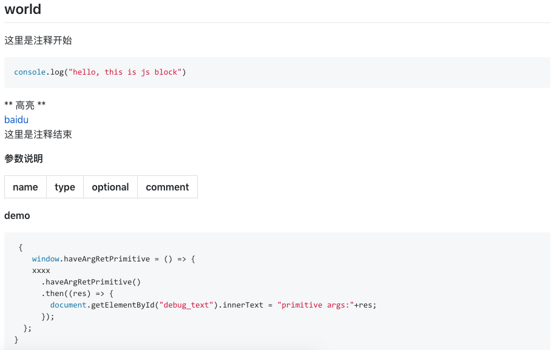

## x-cli

根据api模型， 生成 oc， java， js 三端统一接口与 readme.md。 


>  注意： 不要使用 typescript 的关键字做为类型, 比如 delete new 等等。


### 命令

生成 3 端统一接口

```
x-cli model.ts
```


TODO:将安装 3端 xxxx 1.0.0 模块版本到当前工程

```
x-cli install xxxx@1.0.0
x-cli uninstall xxxx@1.0.0
x-cli update xxxx
x-cli patch 
x-cli init app
x-cli init module


```


TODO: 显示当前工程模块情况

```
x-cli status 
```


### 类型

接口参数只支持两种情况：不传，或传对象。不允许直接传递原生类型。但支持嵌套原生类型。

#### 原生类型

| ts                          | oc                | java      |
| --------------------------- | ----------------- | --------- |
| boolean                     | BOOL              | Boolean   |
| int （扩展，非 ts 类型）    | NSInteger         | Integer   |
| double （慎用，会丢失精度） | double            | Double    |
| string                      | NSString          | String    |
| Array<?>                    | NSArray<?>        | List<?>   |
| Map<?,?\>                   | NSDitionary<?,?\> | Map<?,?\>      |
| Set<?>                      | NSSet<?,?\>       | Set<?,?\>     |


#### 自定义类型

```
interface InnerTitle{
  maintitle: string;
  subtitle: string;
  little: Array<Little>;
}
```


比如：

``` ts
interface SheetDTO {
    title: string;
    itemList?: Array<Map<string,string>>;
    content?: string;
}
```


### 参数

#### 可能情况


|                 | 有返回值（primitive） | 有返回值（对象） | 无返回值 |
| --------------- | --------------------- | ---------------- | -------- |
| 有参(primitive) | 支持                  | 支持             | 支持     |
| 有参(对象)      | 支持                  | 支持             | 支持     |
| 无参            | 支持                  | 支持             | 支持     |


#### 支持嵌套

```
Map<string,Map<string,Map<string,Map<string,string>>>>;
```


#### 支持可选参数

```
title?:string
```


将会生成

``` objective-c
...
@interface SheetDTO: JSONModel
@property(nonatomic,copy) NSString* title;
@property(nonatomic,strong) NSArray<NSDictionary<NSString*,NSString*>*><Optional> * itemList;
@property(nonatomic,copy) NSString<Optional> * content;
@property(nonatomic,strong) CameraDTO*<Optional>  camera;
@end


@interface CameraDTO: JSONModel
@property(nonatomic,assign) bool<Optional>  allowsEditing;
@property(nonatomic,assign) bool<Optional>  savePhotosAlbum;
@property(nonatomic,assign) double<Optional>  cameraFlashMode;
@property(nonatomic,copy) NSString<Optional> * cameraDevice;
@end
... 
```


#### 特殊参数

带`__xxxx__` 前后双下划线的都为系统保留参数.

\_\_event\_\_ 通常用在二级回调。 可按如下方式申明。

```
__event__:(a:string,b:Array<string>) =>void
```

 oc/java 主动调用 js 的桥梁 


### 函数

可以指定默认参数.返回值. 将生成 native 对应类型与接口.

``` typescript
function showActionSheet(sheetDTO:SheetDTO={title:"title",itemList:["a","b","c"],content:"content"}):string {}
```


#### 测试方法

测试方法直接写在函数体内即可

``` typescript
	
function showActionSheet(sheetDTO:SheetDTO={title:"title",itemList:["a","b","c"],content:"content"}){
    window.showActionSheet=()=>{
      xxxx.showActionSheet(
      )
      .then(res=>{
        document.getElementById("debug_text").innerText= res;
      })
    }

    window.showActionSheet()
}
```


#### 自动生成 readme.md

注释仅支持 // ， 支持注释内部 markdown 语法。 

``` typescript
// 这里是注释开始
// ``` js
// console.log("hello, this is js block")
// ```
// **高亮**
// [google 链接](https://www.google.com)
// 这里是注释结束
function funcname(arg:SheetDTO={arg:"abc"}):string {
    window.haveArgRetPrimitive = () => {
    xxxx
      .haveArgRetPrimitive()
      .then((res) => {
        document.getElementById("debug_text").innerText = "primitive args:"+res;
      });
  };
}

```

将生成




### 完整 model.ts

``` typescript
// 命名空间
const moduleID = "com.zkty.module.xxxx";

// dto
interface SheetDTO {
  title: string;
  itemList?: Array<string>;
  content?: string;
  __event__: string;
}
interface MoreDTO {
  title: string;
}

// no args no ret
function noArgNoRet(){
    window.noArgNoRet = () => {
    xxxx
      .noArgNoRet()
      .then((res) => {
        document.getElementById("debug_text").innerText = "no args:"+res;
      });
  };

}

// no args ret primitive
function noArgRetPrimitive():string {
    window.noArgRetPrimitive = () => {
    xxxx
      .noArgRetPrimitive()
      .then((res) => {
        document.getElementById("debug_text").innerText = "primitive args:"+res;
      });
  };
}

// no args ret Object
function noArgRetSheetDTO():SheetDTO {
    window.noArgRetSheetDTO = () => {
    xxxx
      .noArgRetSheetDTO()
      .then((res) => {
        document.getElementById("debug_text").innerText = "SheetDTO args:"+res;
      });
  };
}

// have args no ret
interface HaveArgDTO{
  arg:string;
}
function haveArgNoRet(arg:HaveArgDTO={arg:"abc"}){
    window.haveArgNoRet = () => {
    xxxx
      .haveArgNoRet()
      .then((res) => {
        document.getElementById("debug_text").innerText = "no args:"+res;
      });
  };
}

// have args ret primitive
function haveArgRetPrimitive(arg:HaveArgDTO={arg:"abc"}):string {
    window.haveArgRetPrimitive = () => {
    xxxx
      .haveArgRetPrimitive()
      .then((res) => {
        document.getElementById("debug_text").innerText = "primitive args:"+res;
      });
  };
}

// have args ret Object
function haveArgRetSheetDTO(arg:HaveArgDTO={arg:"abc"}):SheetDTO {
    window.haveArgRetSheetDTO = () => {
    xxxx
      .haveArgRetSheetDTO()
      .then((res) => {
        document.getElementById("debug_text").innerText = "SheetDTO args:"+res;
      });
  };
}
```


## coge

coge 命令是用来根据已被管理的 git 文件快速生成模块。

```
pip3 install coge
```

在 x-engine-module-template 里运行 `coge -r` 生成模板源


如果你要生成 camera 的模块， 在 workspace 里运行。

```
coge x-engine-module-template xxxx:camera @:x-engine-module-camera -w
```

参数说明：

xxxx:camera                 x-engine-module-template 目录里所有的 xxxx  关键字替换成 camera。

@:x-engine-module-camera    生成的目标目录名叫 x-engine-module-camera

-w 	                     默认模板源必须是干净的 git 工程， -w 可忽略这一限制。 但如果你的文件未提交，使用了-w， 将不会出现在目标文件夹。 


