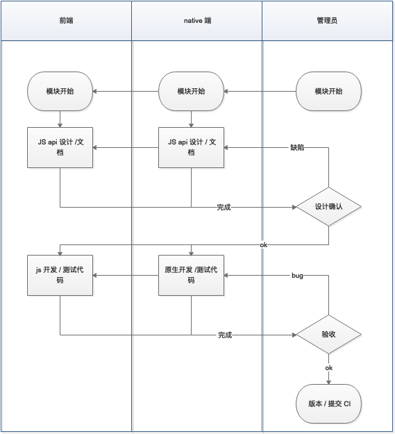
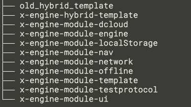
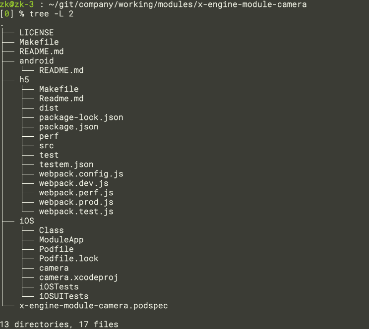

# 组件开发




以上流程大部分可以自动化. 


## 整体流程

xegine 所有相关的组件与应用应放在统一文件夹下。

如 mdoules 下：




```bash
# 安装 coge
pip3 install coge

# 安装 x-cli 
git clone https://github.com/zkty-team/x-engine-api-generator
make install

# 创建 modules 文件夹
mkdir modules && cd modules 

# 克隆远程模板到本地 modules 文件夹
git clone https://www.github.com/zkty-team/x-engine-module-template

# 制作 coge 模板镜像
cd x-engine-module-template  && coge -r 

# 以模板镜像生成工程
cd moduels  && coge x-engine-module-template xxxx:camera @:x-engine-module-camera

# iOS 开发
cd iOS && pod install
```




### 开发技巧

#### 版本与更新

JS

原则很简单，版本号由 <大版本>.<中版本>.<小版本> 构成.

大版本不推荐自动管理. 只针对后面两个.

~ 找最大的小版本号 当 npm install  xxx  ~1.15.2 时, 那可能下载到 1.15.99 的包.

^ 找最小的大版本号 当 npm install  xxx  ^3.3.4 时, 那可能下载到 3.99.99 的包.

举例：


首先要理解, node 这样做的好处.

如果你用 ~, 则保证了 bug 能及时修复,也能及时用上.

如果用 ^, 保证了功能的及时更新,且能兼容.  (中版本号必须保证兼容性)

怎么着你的代码都是能依赖他们跑的.


更新的时候,直接 

```
npm update
```

npm update 会尊重 ~ ^ 的规则. 推荐使用


#### npm link

如果要频繁更改依赖的 node package，则可以使用 npm link 本地化加速修改。在定型后，统一做提交。 这样就不会总是在升级版本。


## IOS

### 组件自动注册

在 iOS 里

以 `__xengine__module_` 为类名开头。 组件则会自动注册。

创建类 继承 `xengine__module_BaseModule`。例如：`__xengine__module_UIModule`

#### 开发

运行工程之前需要 cd 到 Podfile文件所在文件夹 进行 `pod install 或者 pod update ` 然后运行项目

在创建的`__xengine__module_UIModule`.m文件中 重写父类方法

```objective-c
- (NSString *)moduleId
{
    return @"模块id";
}
```

在回调方法中接收 数据 并处理

异步方法

```objc
- (void)funcName:(NSDictionary *)jsonDict complate:(XEngineCallBack)completionHandler
{
 	  ...
		completionHandler(..., YES);
}
```


同步方法

```objective-c
- (id) funcName:(NSDictionary *) dict
{
   	....
    return @"...";
}
```

## android


