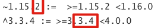

# 组件开发

- 我们为您提供了完善的组件开发流程。
- 您可以按照以下流程进行操作, 既可为业务人员提供一套好用又趁手的组件。


## 整体流程

1. 您可以通过`git clone`我们为您准备好的 [module template](https://www.github.com/zk4/x-engine-module-template) 到本地, 并且修改您的`module`名称(如: 我想开发UI组件,就可以修改为 `x-engine-module-ui`)
  ``` bash
git clone https://www.github.com/zk4/x-engine-module-template -o template  x-engine-module-ui
  ```
2. 在 `github` 上创建新的 `git` 仓库(您可以在自己的`github`上创建的一个新的`public`项目或使用公司的私库)
  ``` bash
cd x-engine-module-ui
git remote add origin git@github.com:zk4/x-engine-module-ui.git
git push --set-upstream origin master
  ```

3. 文件结构

   |- h5

   |- iOS

   |- Android

   |- .gitignore

   |- README.md

4. 进入`h5`项目中安装依赖

   ```bash
   npm install
   ```

5. 您可以执行`npm run dev`在浏览器中查看您我们为您已写好的功能.

6. `src/index.html`：在这里, 我们为您写了`clickActionSheet`的示例, 

   1. 您可以在浏览器中运行(可以用来测试事件是否被成功绑定)
   2. 也可以`npm run build`打包后在手机端运行,因为他调用了xengine的bridge来进行和移动的端的事件传递.

7. `src/index.js`： 在这里, 我们为您提供了`xengine.ui.showActionSheet`的示例,

   1. 您可以详细参考后与移动端进行商讨命名空间的定义, 以及进行自定义组件的开发的逻辑.

8. 修改`package.json` 和 `package-lock.json` 中的` "name": "@zk4/moudle_demo"  ` 为您开发的组件名称

   ```
   "name" : "@zk4/ui"
   ```

10. 为了方便您的测试, 我们为您详细配置了自动化打包后文件的推送,  执行以下命令, 即可将打包过的文件推送至iOS端的文件夹下

    ```bash
    npm dev:device
    ```

11. 运行`iOS`工程, 您即可看到,js端的在移动端运行的效果。

12. 在详细开发过程中
    1. 为了使的各个端对API的统一, 您可以 ``文档化到README.md``
    2. 以js端为准, 供各端参考, 将文档远程链接到 x-engine-doc  

``` json
[{remoteMD}](https://raw.githubusercontent.com/zk4/x-engine-module-ui/master/README.md?token=AAHTKQR3MB2FAWDNWYNV7SS7D2CXS)
```

  >  去掉上面的{}


13. 各端各自开发逻辑,  **一定要有 JS 的逻辑, 至少要有一个 iOS 或 android 端的逻辑.**

14. **在完成相应端测试后, 打上 git tag [版本](./docs/modules/组件-规范.md#版本), 将相应端代码打包到私库** (暂行)

> 在 CI 系统构建完成后, 最后一步将代码推送到 CI 系统, 由 CI 跑测试与引擎的集成度, 与代码覆盖率, 代码覆盖率低于90% 标准将被拒绝发布组件.
>
> 组件 README.md 将会自动集成到[组件仓库].

​    

## JS 

### 修改 package.json

``` json
{
  "name": "@zk4/nav",   // js 组件名
  "version": "1.0.0",   // js 组件版本
  "description": "",
  "main": "src/index.js", // 打包入口文件
  "repository": {
    "type": "git",
    "url": "ssh://git@github.com/zk4/x-engine-npm.git"  // 私库地址
  },
  "scripts": {
    "dev": "webpack-dev-server --mode development --open --hot",
    "build": "webpack --mode production",
    "build:with-prod-config": "webpack  --config webpack.prod.js"
  },
  "author": "zk4",
  "license": "ISC",
  "devDependencies": {
    "@babel/core": "^7.10.4",
    "@babel/preset-env": "^7.10.4",
    "babel-loader": "^8.1.0",
    "css-loader": "^3.6.0",
    "file-loader": "^1.1.11",
    "html-webpack-plugin": "^4.3.0",
    "style-loader": "^1.2.1",
    "webpack": "^4.43.0",
    "webpack-cli": "^3.3.12",
    "webpack-dev-server": "^3.11.0",
    "webpack-merge": "^5.1.4"
  },
  "dependencies": {
    "@zk4/xengine": "^1.0.9"  //依赖的 js 引擎
  }
}

```

> 如果是上传到私库， 请参考     [私地址-npm 章节](./docs/modules/组件-仓库.md#npm)


### 开发技巧

#### 版本与更新

原则很简单，版本号由 <大版本>.<中版本>.<小版本> 构成.

能过 ~ ^ 管理最常见, 大版本是没法自动管理的. 只针对后面两个.

~ 找最大的小版本号 当 npm install  xxx  ~1.15.2 时, 那可能下载到 1.15.99 的包.

^ 找最小的大版本号 当 npm install  xxx  ^3.3.4 时, 那可能下载到 3.99.99 的包.

举例：



首先要理解, node 这样做的好处.

如果你用 ~, 则保证了 bug 能及时修复,也能及时用上.

如果用 ^, 保证了功能的及时更新,且能兼容.  (中版本号必须保证兼容性)

怎么着你的代码都是能依赖他们跑的.


更新的时候,直接 

```
npm update
```

npm update 会尊重 ~ ^ 的规则. 推荐使用


#### npm link

如果要频繁更改依赖的 node package，则可以使用 npm link 本地化加速修改。在定型后，统一做提交。 这样就不会总是在升级版本。


## IOS

### 组件自动注册

在 iOS 里

以 `__xengine__module_` 为类名开头。 组件则会自动注册。


## android


