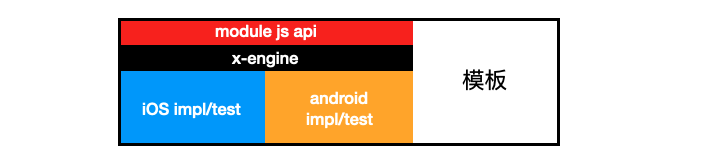

组件由 3 部分构成.



组件模板会多包含一层 x-engine, 以供开发者调试测试用. 在发布后将不会包含. 见下文[模板目录结构].


## 模板目录结构

- x-engine-module-template
  - iOS
    - podfile
  - android
    - app
      - build.gradle
    - build.gradle
  - h5
    - index.js
    - package.json
  - README.md
  - module.json

## module.json
见 [module.json](./docs/configfile/config.md#module.json)

## 权限申请

iOS: 按本地应用申请即可.

android: https://developer.android.google.cn/training/permissions/usage-notes#dont-overwhelm

## 权限询问的时机

|         | CRITICAL                         | CRITICAL          |       |
| ------- | -------------------------------- | ----------------- | ----- |
| UNCLEAR | 启动时,告诉用户为什么需要,弹出   | 启动时,直接弹出   | CLEAR |
| UNCLEAR | 在使用时,告诉用户为什么需要,弹出 | 在使用时,直接弹出 | CLEAR |
|         | NON-CRITICAL                     | NON-CRITICAL      |       |


## 组件分类

* 通用组件

  直接集成到应用开发模板工程里. 稳定性好.有良好的集成测试.

* 可选组件

  需要用户自己手动注册, 各插件件的兼容性并没得到很好测试, 但一般都可正常使用.


## 版本

将使用 git tag 打上版本, 比如 **git tag 1.0.0**

<大版本>.<中版本>.<小版本>

|        | api 返回值修改 | api 增加 | api 删除 | api 修内部 bug |
| ------ | -------------- | -------- | -------- | -------------- |
| 大版本 | ^              |          | ^        |                |
| 中版本 |                | ^        |          |                |
| 小版本 |                |          |          | ^              |


## js API 约束

约定所有 js API 统一采用如下调用方式

``` js
// 异步
xengine.模块名.方法({
    参数1: "",
    参数2: "",
    success: fucntion(result) {
        // 成功回调
    },
    error: fucntion(error) {
        // 失败回调
    }
});
// 或者使用 promise 
xengine.模块名.方法({
    参数1: "",
    参数2: "")
.then(result=>{})
.catch(error=>{})


// 同步
try {
  var result = xengine.模块名.方法({
      参数1: "",
      参数2: ""
  });
}catch (e){
  
}

```

**约束说明**

* 所有接口一定支持异步调用, 部分支持同步调用
* 接收一个`object`类型的参数
* 成功回调`success`
  * 通过`result`获取成功数据
  * 回调函数的触发时机由具体的API决定，有的API是调用时即可回调（短期），有的是某个事件触发后才被回调（长期）
* 失败回调`error`，所有的API调用错误都会走失败回调


iOS 与 android 端将需要根据 js 端的规则做实现. 

> 为什么以 js 为标准? 因为只要涉及到使用组件, 一定会调用到 js, 而且有可能组件的原生实现只有 iOS 端, 而还缺少 android 端.


##  js API 注册

默认情况下，常用组件会集成到工程模板中 

但是假设某项目中突然遇到了一个需求，要新增一个支付功能，并且要以API的形式提供给H5页面调用，该如何实现呢？

各个项目可以拓展自己的组件,如下

``` js
// 1.前端config时，传入需要注册的组件别名
xengine.config({
   user_modules: ['pay', 'speech']
});
// 2.原生框架中，接收到config后，基于传入的别名，去对应项目配置文件中查询路径，然后将对应路径的API实现类注册
// 对应的组件的API实现类不是放框架中的，而是由各自的项目管理的，到时候框架就是一个固定的库，给各个项目引用
// 3.前端中，通过一个固定的方法，调用刚注册的组件API中的功能
xengine.callApi({
    funcName: 'xxx',
    muduleName: 'pay',
    ...
    data: {},
    success: function(result) {},
    error: function(error) {},
});
```

通过这一套机制，可以保持框架的可拓展性，就算应用不同的项目中，N多的功能，也能通过这种方法拓展，保持一致的使用


## polyfill 

为不同的环境做好区分，现在的环境包含

- iOS
- android
- h5

尤其在 h5 下，不支持的接口直接用 js 弹框表示不支持，这样， 业务人员可以在 h5 里尽快发现， 并做处理。

判定设备

``` js
// 判断设备类型
var judgeDeviceType = function () {
  var ua = window.navigator.userAgent.toLocaleLowerCase();
  var isIOS = /iphone|ipad|ipod/.test(ua);
  var isAndroid = /android/.test(ua);

  return {
    isIOS: isIOS,
    isAndroid: isAndroid
  }
}()
```

