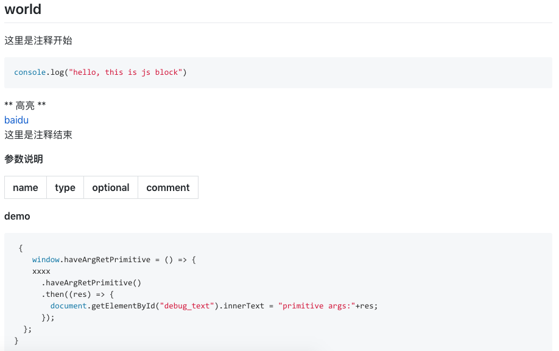

## 安装 

 ```
git clone git@github.com:zkty-team/x-cli.git
make install
 ```


## 命令

命令主要分为三个方向

model  负责模型的生成

module 负责模块的管理

app    负责应用的管理

常用命令如下 

```
// microap 环境搭建
x-cli app init 

// 列举当前可用设备
x-cli app devices

## 模块环境搭建
x-cli module init 

// 查看线上模块
x-cli module list

//安装模块
x-cli module install <xxxx>

//卸载模块
x-cli module uninstall xxxx@1.0.0

// 升级模块
x-cli modules update xxxx


// 运行 ios 模拟器
x-cli app run ios:simulator  
x-cli app run ios
x-cli app run h5
x-cli app run android:simulator
x-cli app run android

x-cli module patch
x-cli module publish
```

 

### model

根据 [model.ts](#model.ts语法)  定义， 生成 oc， java， js 三端统一接口与 readme.md。 

h5:

```
./src/mock.js     h5 mock 用，不存在时会生成一次，所以可修改。
./src/index.html  每次覆盖
./src/index.js    每次覆盖
./src/demo.js     每次覆盖
```


java:

````
// 接口文件， dto 规范。每次覆盖
gen/xengine__module_xxxx.java 
````


oc:

```
// 接口文件， dto 规范。每次覆盖
gen/xengine__module_xxxx.h 
gen/xengine__module_xxxx.m 
```


#### model.ts语法

model.ts 脚本的语法与 typescript 几乎一样。

>  注意： 不要使用 typescript 的关键字做为参数名, 比如 delete new 等等

#### 类型

接口参数只支持两种情况：不传，或传 {}。 如果你只有一个参数，比如只有一个 int，可以用对象包住， { index:int }

##### 原生类型

| ts                          | oc                | java      |
| --------------------------- | ----------------- | --------- |
| boolean                     | BOOL              | Boolean   |
| int （扩展，非 ts 类型）    | NSInteger         | Integer   |
| double （慎用，会丢失精度） | double            | Double    |
| string                      | NSString          | String    |
| Array<?>                    | NSArray<?>        | List<?>   |
| Map<?,?\>                   | NSDitionary<?,?\> | Map<?,?\>      |
| Set<?>                      | NSSet<?,?\>       | Set<?,?\>     |


##### 自定义类型

```
interface InnerTitle{
  maintitle: string;
  subtitle: string;
  little: Array<Little>;
}
```


比如：

``` ts
interface SheetDTO {
    title: string;
    itemList?: Array<Map<string,string>>;
    content?: string;
}
```


#### 参数

##### 可能情况


|                 | 有返回值（primitive） | 有返回值（对象） | 无返回值 |
| --------------- | --------------------- | ---------------- | -------- |
| 有参(primitive) | 支持                  | 支持             | 支持     |
| 有参(对象)      | 支持                  | 支持             | 支持     |
| 无参            | 支持                  | 支持             | 支持     |


##### 支持嵌套

```
Map<string,Map<string,Map<string,Map<string,string>>>>;
```


##### 支持可选参数

```
title?:string
```


将会生成

``` objective-c
...
@interface SheetDTO: JSONModel
@property(nonatomic,copy) NSString* title;
@property(nonatomic,strong) NSArray<NSDictionary<NSString*,NSString*>*><Optional> * itemList;
@property(nonatomic,copy) NSString<Optional> * content;
@property(nonatomic,strong) CameraDTO*<Optional>  camera;
@end


@interface CameraDTO: JSONModel
@property(nonatomic,assign) bool<Optional>  allowsEditing;
@property(nonatomic,assign) bool<Optional>  savePhotosAlbum;
@property(nonatomic,assign) double<Optional>  cameraFlashMode;
@property(nonatomic,copy) NSString<Optional> * cameraDevice;
@end
... 
```


##### 特殊参数

带`__xxxx__` 前后双下划线的都为系统保留参数.

\_\_event\_\_ 通常用在二级回调。 可按如下方式申明。

```
__event__:(a:string,b:Array<string>) =>void
```

 oc/java 主动调用 js 的桥梁 


#### 函数

可以指定默认参数.返回值. 将生成 native 对应类型与接口.

``` typescript
function showActionSheet(sheetDTO:SheetDTO={title:"title",itemList:["a","b","c"],content:"content"}):string {}
```


#### 测试方法

测试方法直接写在函数体内即可, 逻辑上就是在 `index.html` 生成以函数名为 name 的 `<button>`标签，并绑定方法。将函数体里的代码 copy 到 `demo.js` ，并暴露给 window。

``` typescript
	
function showActionSheet(sheetDTO:SheetDTO={title:"title",itemList:["a","b","c"],content:"content"}){
    window.showActionSheet=()=>{
      xxxx.showActionSheet(
      )
      .then(res=>{
        document.getElementById("debug_text").innerText= res;
      })
    }
}
```

也支持在方法前写上 test 生成 UI 测试按钮。

````js
function testHelloButton(){
    window.testHelloButton=()=>{
      xxxx.showActionSheet(
        // 注意这里的参数
      	{title:"title",itemList:["a","b","c"],content:"content"}
      )
      .then(res=>{
        document.getElementById("debug_text").innerText= res;
      })
    }

}
````


#### 注释

注释是用来生成 readme.md，一定要写在函数定义的上面。

支持 /* */

支持 // 

支持注释内部 markdown 语法。 

``` typescript
// 这里是注释开始
// ``` js
// console.log("hello, this is js block")
// ```
// **高亮**
// [google 链接](https://www.google.com)
// 这里是注释结束
function funcname(arg:SheetDTO={arg:"abc"}):string {
    window.haveArgRetPrimitive = () => {
    xxxx
      .haveArgRetPrimitive()
      .then((res) => {
        document.getElementById("debug_text").innerText = "primitive args:"+res;
      });
  };
}

```

将生成




####  model.ts demo

``` typescript
// 命名空间
const moduleID = "com.zkty.module.xxxx";

// dto
interface SheetDTO {
  title: string;
  itemList?: Array<string>;
  content?: string;
  __event__: string;
}
interface MoreDTO {
  title: string;
}

// no args no ret
function noArgNoRet(){
    window.noArgNoRet = () => {
    xxxx
      .noArgNoRet()
      .then((res) => {
        document.getElementById("debug_text").innerText = "no args:"+res;
      });
  };

}

// no args ret primitive
function noArgRetPrimitive():string {
    window.noArgRetPrimitive = () => {
    xxxx
      .noArgRetPrimitive()
      .then((res) => {
        document.getElementById("debug_text").innerText = "primitive args:"+res;
      });
  };
}

// no args ret Object
function noArgRetSheetDTO():SheetDTO {
    window.noArgRetSheetDTO = () => {
    xxxx
      .noArgRetSheetDTO()
      .then((res) => {
        document.getElementById("debug_text").innerText = "SheetDTO args:"+res;
      });
  };
}

// have args no ret
interface HaveArgDTO{
  arg:string;
}
function haveArgNoRet(arg:HaveArgDTO={arg:"abc"}){
    window.haveArgNoRet = () => {
    xxxx
      .haveArgNoRet()
      .then((res) => {
        document.getElementById("debug_text").innerText = "no args:"+res;
      });
  };
}

// have args ret primitive
function haveArgRetPrimitive(arg:HaveArgDTO={arg:"abc"}):string {
    window.haveArgRetPrimitive = () => {
    xxxx
      .haveArgRetPrimitive()
      .then((res) => {
        document.getElementById("debug_text").innerText = "primitive args:"+res;
      });
  };
}

// have args ret Object
function haveArgRetSheetDTO(arg:HaveArgDTO={arg:"abc"}):SheetDTO {
    window.haveArgRetSheetDTO = () => {
    xxxx
      .haveArgRetSheetDTO()
      .then((res) => {
        document.getElementById("debug_text").innerText = "SheetDTO args:"+res;
      });
  };
}
```

#### 非引擎环境兼容

很多时候，我们的微应用并不在引擎环境下， 在生成 model 时，会生一个 mock.js。你可以在里面定义你认为对的函数调用。

```js
// MODIFIABLE! 
// generated by x_cli,
// only generated when file is not existed!

export default {
    noArgNoRet(args={},userPromise){
      if(userPromise){
        return userPromise()
      }else{
        return new Promise((resolve, reject)=>{
          // 在这里写你的实现
          alert("noArgNoRet no h5 implementation, you can implement this function in mock.js in  h5/src/mock.js");
          resolve(null);
        });
      }
   }
}
```

### module

### app

