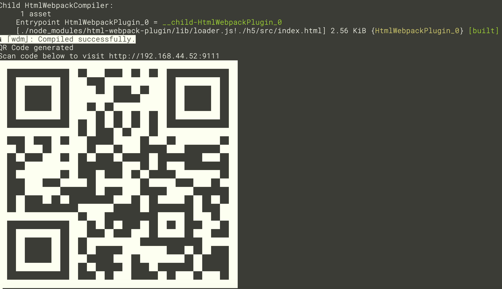

# microApp

microApp 是基于多个官方模块的一个功能性打包产品，模块包含了 network, bridge, nav, tools, web。

可以基于 h5 开发类似微信的小程序，并支持热更新


x-engine-app-template 是用来做最终发布,集成了当前成熟的 x-engine 模块


## 环境搭建

### 快速环境

1. 使用 vue-cli 创建自己的项目.
4. 在 webpack 里配置 https://github.com/MrBenJ/webpack-dev-server-qr-code-plugin. 启动工程时,将自动生一个二维码.
5. 安装 [x-engine-app-template](), 扫描二维码,即可实时开发.



## 开发流程

在使用到微应用模块的 api 时, 如 camera

### 基于基座

基座集成了当前必要的插件, 基座下载地址.


```
安装
npm install @zkty-team/x-engine-module-camera

升级
npm update @zkty-team/x-engine-module-camera
```

api 文档在 [所有模块-api](./docs/modules/all/模块-engine.md),如果 api 缺失, 请与引擎开发人员联系.

ios: https://www.pgyer.com/hIVq

android: todo 


## 打包给引擎组

一般使用生产环境的包,

```
npm run dist
```


确保入口为 index.html.

确保可以本地 file://... 打开,路由正确. 

如遇到跨域问题, 推荐以下

1. 使用 @zkty-team/x-engine-module-network 模块
2. 或者,服务端本身支持跨域


微应用包格式如下：

- {microAppId}.{version}.zip
  - index.html
  - ..


## 热更新

我们提供了一个全自动的离线部署的模块，但需要服务端配合。参看[x-engine-module-offline](../modules/模块-offline.md)

我们也支持更灵活的在微应用内部手动请求更新，组合使用 [x-engine-module-tools](../modules/模块-tools.md) 与 [x-engine-module-network](../modules/模块-network.md) 模块即可。


## xengine_config.json

``` json
{
  "appId": "com.zkty.xiaoqu",    // 建议直接设置为应用的 Bundle Identifier
  "appSecret": "8b387ca3ebdd412e9c97ef81ed352ee7",  //随机 md5 值.
  "offlineServerUrl": "https://3rd-public-file.oss-cn-beijing.aliyuncs.com"  //服务器地址
}
```

appId 是应用唯一id，用户指定，服务器判别是否有效。

appSecret 应该由服务器生成。

offlineServerUrl 为离线包更新地址。

> 在没有服务器逻辑，只有类似 ftp 的情况下， appId 与 appSecret 手动指定， 以备日后不时之需。

 


