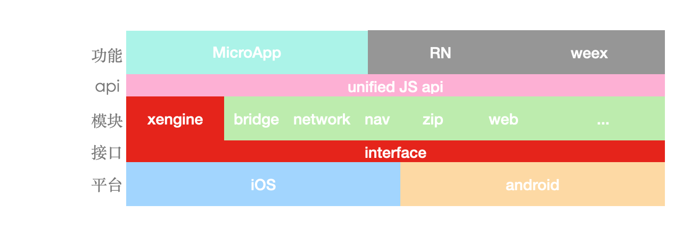

x-engine 理论上只负责管理模块， 但因为当前业务需求，我们提供了一些具体功能。比如支持类似小程序的 MicroApp。

## 架构图

## 组件化

组件开发可见： [组件-开发.md](../../modules/组件-开发.md) 

在文档里组件被分为[通用组件](./docs/modules/组件-规范.md#组件分类),与[可选组件](./docs/modules/组件-规范.md#组件分类)

通用组件示例:[引擎](./docs/modules/common/组件-引擎.md)  [统一网络](./docs/modules/common/组件-统一网络.md)  [原生导航](./docs/modules/common/组件-原生导航.md) ...

可选组件示例: [蓝牙](./docs/modules/optional/组件-蓝牙.md)  ...

通用组件与可选组件并没有本质差别， 只是通用组件会集成到 hybrid-template  中， 官方保证了组件间的兼容性。 

引擎本身就有有可能会依赖某些组件，如 network， 被依赖的组件会以接口的形式被引用，用户如果需要自定义自己的 network 组件，则必须实现相应的接口，在 iOS 里表现为 protocol 接口，在 android 里则是 interface接口， 接口定义在引擎里。

这样做的原因是： 

当引擎所依赖的组件与用户组件相冲突时， 用户可以替换引擎组件，又不影响引擎的功能。

###  自动注册组件

现在的 xengine 里组件是怎么自动注册的呢？

通过约定文件名，没错！暴力如斯！

以 `__xengine__module_` 为类名开头。 组件则会自动注册。

创建类 继承 `xengine__module_BaseModule`。例如：`__xengine__module_UIModule`

虽然简单，但在 iOS 里与 android 都非常容易实现。

### 依赖注入

依赖注入是 spring 最强大的功能。 xengine 里暂时并未完全实现。

spring 能够注入循环依赖， 在当前框架模型下暂时未用到。

TODO: 整合市面上已存的 android 注入框架，与 iOS 注入框架。

现在的注入还是需要手工注入，因为不考虑组件的循环依赖， 所以，我们只需在所有组件初始化后，一一回调即可，见 [组件-engine.md](../../modules/all/组件-engine.md) 

 

