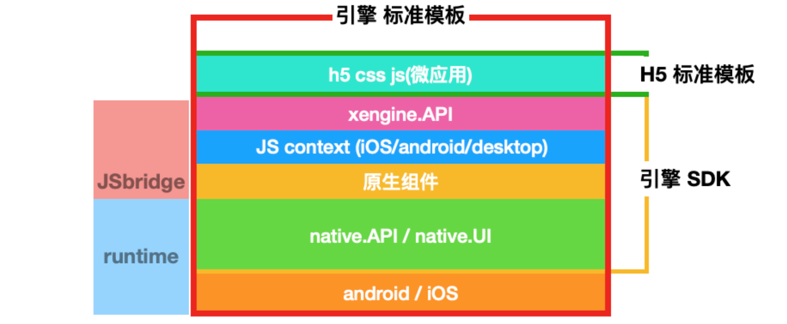
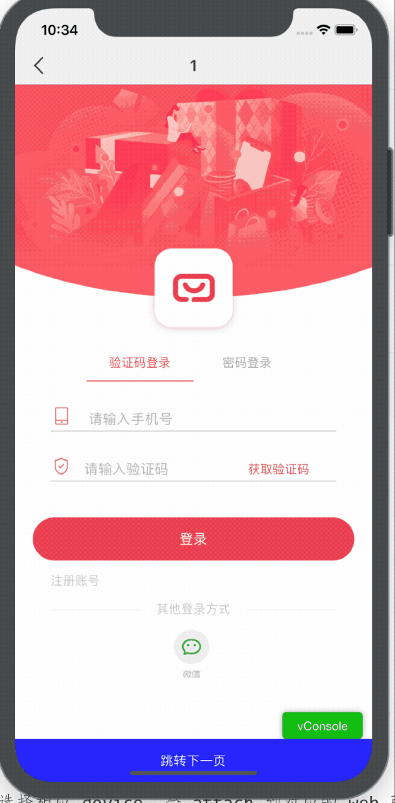

## 概述
为适应需求的快速变化, 节省开发成本. 
通用的技术功能将以逐步组件化下沉到引擎集成.
整体架构将基于 native + SPA(h5).

## 架构

 

## 核心机制

### web 容器选型

android 各平台 web 引擎差异太大, android 将统一基于 X5 web 引擎.

iOS 端将统一使用 WkWebview

### h5 与 native 交互

初期会使用 dsbridge 统一 iOS 和 android 的 js 与原生的交互. 

js <-> java / oc ,可同步, 可异步. 数据仅为简单数据的传递.

涉及到视频, 音频的处理. h5 不方便处理.

需要 js 层调用原生层的 view . 由原生层直接处理所有交互. 

### webview 离线渲染

离线渲染保证了平滑的页面切换, 达到与原生基本一样的体验. 

可根据不同性能的机型, 使用双缓冲渲染, 三缓冲渲染, 以及 池化 webview .

三者都支持无限制下一页.

|            | 原生动画 | 性能           | 历史页面状态保持                       | 无缝后退 | 无缝前进 |
| ---------- | -------- | -------------- | -------------------------------------- | -------- | -------- |
| 双缓冲     | 支持     | 很高           | 能通过 url 复现界面,仅中间状态无法保持 | 支持     | 不支持   |
| 三缓冲     | 支持     | 高             | 能通过 url 复现界面,仅中间状态无法保持 | 支持     | 支持     |
| 无限渲染池 | 支持     | 随页面层级而定 | 支持                                   | 支持     | 支持     |

双缓冲渲染:

三缓冲渲染: 

与双缓冲的区别在于, forward buffer 永远是空, 这样不会出现闪历史界面的问题.

池化 webview 渲染池:

通用技术. 模拟线程池, 预加载 n 个, 根据需求自动收缩增长. 实现最简单, 效果最好, 唯一的缺点, 吃内存.

#### 统一 header

header 用原生的做,这样, 可以一定程度上提高用户体验, 如果页面无响应, 用户可以返回. 不至于只能杀死进程.

需要改进 vue 里的路由. 在 js / vue 里路由跳转界面时. 通知原生层. 创建新 web 引擎.

注意: 新的路由地址必须唯一.

### 统一网络

网络是除缓存外最核心的一块功能. 

需要将 h5 的网络统一由 native 做一层代理, 来解决 cookie 共享, 安全, 跨域, 缓存, 路由等问题.

浏览器本身自带的网络请求功能, 只做加载第三方链接的标签资源用. 要达到如微信小程序的感觉, 可直接屏蔽.

其他请求全必须走本地网络.

方案会基于异步封装 native 网络请求.

#### 白名单

本地网络出口要设白名单， 防止xss。

白名单配置在服务器上。在下载离线包时，读入配置。

配置做签名，防止篡改。

## 质量控制

### 兼容性测试

使用岩鼠平台(付费): https://yanshu.effirst.com/product/real-devices/overview

可在引擎 ship 前,对市面上的常用机型做兼容性测试.

### 性能测试

dokit http://xingyun.xiaojukeji.com/docs/dokit/#/intro

xcode 自带 instrument

* 重点: 内存加载

### 线上错误日志管理

native 错误可以使用市面上成熟的方案,如 bugly, 友盟.

h5 相关错误. 可使用 sentry 自行搭建. 也可使用成熟方案(未研究).

*reference*

android virtualAPK: https://didi.github.io/virtual-apk.html

