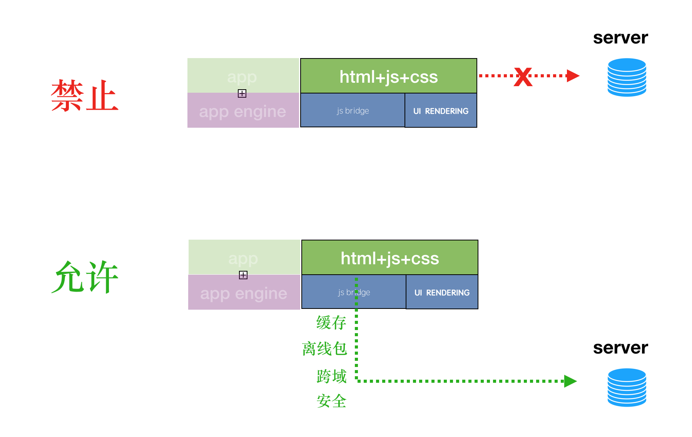

## 概述

为适应需求的快速变化, 节省开发成本. 应用架构将主要分为两块, 引擎+业务.

引擎将服务于多个 app. 业务将针对特点项目而定制开发.

通用的技术功能将以逐步组件化下沉到引擎集成.

整体架构将基于 native + SPA(h5).

技术细节文档: 参看 [应用架构-技术细节.md](./%E5%BA%94%E7%94%A8%E6%9E%B6%E6%9E%84-%E6%8A%80%E6%9C%AF%E7%BB%86%E8%8A%82.md)

## 架构

 


## 核心机制

### web 容器选型

android 各平台 web 引擎差异太大, android 将统一基于 X5 web 引擎.

iOS 端将统一使用 WkWebview

### h5 与 native 交互

初期会使用 dsbridge 统一 iOS 和 android 的 js 与原生的交互. 

js <-> java / oc ,可同步, 可异步. 数据仅为简单数据的传递.

涉及到视频, 音频的处理. h5 不方便处理.

需要 js 层调用原生层的 view . 由原生层直接处理所有交互. 


### webview 离线渲染

离线渲染保证了平滑的页面切换, 达到与原生基本一样的体验. 

可根据不同性能的机型, 使用双缓冲渲染, 三缓冲渲染, 以及 池化 webview .

三者都支持无限制下一页.

|            | 原生动画 | 性能           | 历史页面状态保持                       | 无缝后退 | 无缝前进 |
| ---------- | -------- | -------------- | -------------------------------------- | -------- | -------- |
| 双缓冲     | 支持     | 很高           | 能通过 url 复现界面,仅中间状态无法保持 | 支持     | 不支持   |
| 三缓冲     | 支持     | 高             | 能通过 url 复现界面,仅中间状态无法保持 | 支持     | 支持     |
| 无限渲染池 | 支持     | 随页面层级而定 | 支持                                   | 支持     | 支持     |

双缓冲渲染:


三缓冲渲染: 

与双缓冲的区别在于, forward buffer 永远是空, 这样不会出现闪历史界面的问题.


池化 webview 渲染池:

通用技术. 模拟线程池, 预加载 n 个, 根据需求自动收缩增长. 实现最简单, 效果最好, 唯一的缺点, 吃内存.


#### 统一 header

header 用原生的做,这样, 可以一定程度上提高用户体验, 如果页面无响应, 用户可以返回. 不至于只能杀死进程.

需要改进 vue 里的路由. 在 js / vue 里路由跳转界面时. 通知原生层. 创建新 web 引擎.

注意: 新的路由地址必须唯一.


#### 统一网络

网络是除缓存外最核心的一块功能. 

需要将 h5 的网络统一由 native 做一层代理, 来解决 cookie 共享, 安全, 跨域, 缓存, 路由等问题.

浏览器本身自带的网络请求功能, 只做加载第三方链接的标签资源用. 要达到如微信小程序的感觉, 可直接屏蔽.

其他请求全必须走本地网络.

方案会基于异步封装 native 网络请求.




#### 白名单

本地网络出口要设白名单， 防止xss。

白名单配置在服务器上。在下载离线包时，读入配置。

配置做签名，防止篡改。


### xengine.api

JS API 将抹平 ios 与 android 等其他平台的调用差异. 

主要包含路由, 网络,存储, 硬件调用, 等.


* API约束（包括调用格式，传参格式，回调格式）
* 功能规划（约定这个框架应该提供什么样的功能）
* 权限校验（校验后才能调用，包括权限校验的代码格式，校验一些什么内容，以及哪些API无需校验）
* 模块化的API（按照模块划分，每一个模块可以作为单独的组件，便于拓展）
* 其它优化（如在PC端调试API的页面，部分API支持Promise等）

#### API 约束

约定所有API统一采用如下调用方式

``` js
xengine.模块名.方法({
    参数1: "",
    参数2: "",
    success: fucntion(result) {
        // 成功回调
    },
    error: fucntion(error) {
        // 失败回调
    }
});
// 或者使用 promise 
xengine.模块名.方法({
    参数1: "",
    参数2: "")
.then(result=>{})
.catch(error=>{})

```

**约束说明**

* 所有接口都为异步调用
* 接收一个`object`类型的参数
* 成功回调`success`
  * 通过`result`获取成功数据
  * 回调函数的触发时机由具体的API决定，有的API是调用时即可回调（短期），有的是某个事件触发后才被回调（长期）
* 失败回调`error`，所有的API调用错误都会走失败回调


> promise 一样.


#### 功能规划

``` js
xengine   
		|- net
		|   |- request  post get put head
    |   |- fileupload  
		|- ui               // 系统ui组件
    |   |- toast
    |   |- alert
    |   |- confirm
    |   |- prompt
    |   |- showWaiting
    |   |- closeWaiting
    |   |- actionSheet
    |   |- pickDate
    |   |- pickTime
    |   |- pickDateTime
    |   |- popWindow
    |- page             // 页面（webview）管理
    |   |- open
    |   |- openLocal
    |   |- close
    |   |- reload
    |- navigator        // 导航栏控制
    |   |- setTitle
    |   |- setMultiTitle
    |   |- hookSysBack
    |   |- hookBackBtn
    |   |- setRightBtn
    |   |- setLeftBtn
    |   |- setRightMenu
    |- auth             // 权限认证相关
    |   |- getToken
    |- device           // 设备相关
    |   |- setOrientation
    |   |- getDeviceId
    |   |- getNetWorkInfo
    |   |- getVendorInfo
    |   |- closeInputKeyboard
    |   |- vibrate
    |   |- callPhone
    |   |- sendMsg
    |- runtime          // 运行环境
    |   |- launchApp
    |   |- getAppVersion
    |   |- getxengineVersion
    |   |- getGeolocation
    |   |- clearCache
    |   |- clipboard
    |   |- openUrl
    |- util             // 其它工具
    |   |- scan
    |   |- selectImage
    |   |- cameraImage
    |   |- selectFile
    |   |- openFile
```


> 详情见日后 xengine.api 文档.md.

#### 权限校验(可选)

根据不同需求，可以划分以下等级。

* 平台级别的（像钉钉、微信这类对外开放的），需要配合后台，有完整的授权，签名，校验机制
* 项目级别的（N个项目同一个框架，但业务各不相同），简单的应用内部配置，直接校验一些域名白名单信息即可

``` js
xengine.error(function(error) {
    // 全局错误处理
});

xengine.config({
    ...
});
xengine.ready(function() {
    // TODO: 处理验证成功后的事情，例如调用api
});
```

如果`config`失败或者没有校验，那么敏感API都无法调用

**无需校验就可用的API**

并不是所有API都需校验后才能用，我们约定以下API默认就可用（这里是一个粗糙的划分，实际上可以精确到每一个API）

``` js
ui模块的所有API
page模块的所有API
navigator模块的所有API
```


####  模块化

有一个全局变量`xengine`，但API并不是直接绑定在全局变量下，而是按模块划分，譬如

``` js
xengine.ui
xengine.device
xengine.page
...
```


**组件API的拓展机制**

默认情况下，框架会注册以下组件

``` js
ui
page
navigator
auth
device
runtime
util
```

但是假设某项目中突然遇到了一个需求，要新增一个支付功能，并且要以API的形式提供给H5页面调用，该如何实现呢？

各个项目可以拓展自己的组件,如下

``` js
// 1.前端config时，传入需要注册的组件别名
xengine.config({
   user_modules: ['pay', 'speech']
});
// 2.原生框架中，接收到config后，基于传入的别名，去对应项目配置文件中查询路径，然后将对应路径的API实现类注册
// 对应的组件的API实现类不是放框架中的，而是由各自的项目管理的，到时候框架就是一个固定的库，给各个项目引用
// 3.前端中，通过一个固定的方法，调用刚注册的组件API中的功能
xengine.callApi({
    funcName: 'xxx',
    muduleName: 'pay',
    ...
    data: {},
    success: function(result) {},
    error: function(error) {},
});
```

通过这一套机制，可以保持框架的可拓展性，就算应用不同的项目中，N多的功能，也能通过这种方法拓展，保持一致的使用

如果组件已完善, 可以将组件合并归类到正式引擎模块. 调用方法改为

```
xengine.<muduleName>.<funcName>
```


### 组件

组件的主要作用就是提供 h5 到本地的 adapter. 组件的加载主要有两种方案.

* 通用组件:直接集成到应用引擎.直接集成到应用引擎从开发速度与稳定性来讲, 都是最优.
* 可选组件:动态加载, 主要解决的问题是, 引擎打包后过于膨胀.
二进制的更新在 android 上有非常成熟的解决方案. 而 ios 相对来说都是些厂商的黑科技. 开源的已全被封了. 如jspatch, rollout.io

*在引擎 1.0 阶段. 组件将会直接集成到引擎一起发布.*

 

> 组件详细文档见组件 1.0 规范文档. *重点是统一 android 与 iOS 的接口。*

#### 基本组件

* toast
* 消息推送
* 统计埋点
* 统一存储与读取
* 调用摄像头 / 相册
* 社交分享
* 定位
* 设备标识

参考 dcloud apicloud https://www.html5plus.org/doc

#### 权限申请

iOS: 按本地应用申请即可.

android: https://developer.android.google.cn/training/permissions/usage-notes#dont-overwhelm

权限询问的时机:

|  | CRITICAL | CRITICAL |  |
| --- | -------- | -------- | --- |
| UNCLEAR | 启动时,告诉用户为什么需要,弹出 | 启动时,直接弹出 | CLEAR |
| UNCLEAR | 在使用时,告诉用户为什么需要,弹出 | 在使用时,直接弹出 | CLEAR |
|  | NON-CRITICAL | NON-CRITICAL |  |

#### 测试与运维

##### 兼容性测试

使用岩鼠平台(付费): https://yanshu.effirst.com/product/real-devices/overview

可在引擎 ship 前,对市面上的常用机型做兼容性测试.

##### 性能测试

dokit http://xingyun.xiaojukeji.com/docs/dokit/#/intro

xcode 自带 instrument

* 重点: 内存加载

#### 线上错误日志管理

native 错误可以使用市面上成熟的方案,如 bugly, 友盟.

h5 相关错误. 可使用 sentry 自行搭建. 也可使用成熟方案(未研究).

### 引擎 1.0 产品方向

* [x] 统一 header。
* [x] 统一网络。
    * [ ] 网络白名单。
* [x] 基于离线包。
    * [ ] 差分包。
* [ ] 组件标准。
    * [ ] android /iOS / h5
* [ ] 组件文档 - docsify。
* [ ] 业务模板 h5 标准范式。

### 引擎 2.0 产品方向

* 支持发布 web 版.
* 组件模块动态化. (可选)
* 提升安全性

android virtualAPK: https://didi.github.io/virtual-apk.html

#### h5

业务代码, 可直接使用 chrome 调度试.

#### native + h5

* 可以打开 safri 选择相应 device. 会 attach 到对应的 web 引擎渲染的内容.


