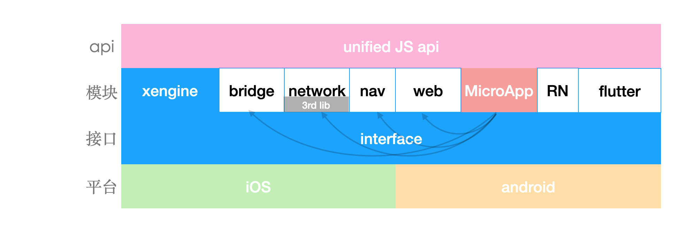
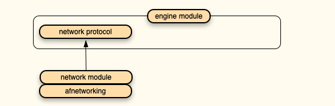

x-engine 理论上只负责管理模块， 但因为当前业务需求，我们提供了一些具体功能。比如支持类似小程序的 MicroApp。

## 架构图

## 模块化

模块开发可见： [模块-开发.md](../../modules/模块-开发.md) 

在文档里模块被分为[通用模块](./docs/modules/模块-规范.md#模块分类),与[可选模块](./docs/modules/模块-规范.md#模块分类)

通用模块示例:[引擎](./docs/modules/common/模块-引擎.md)  [统一网络](./docs/modules/common/模块-统一网络.md)  [原生导航](./docs/modules/common/模块-原生导航.md) ...

可选模块示例: [蓝牙](./docs/modules/optional/模块-蓝牙.md)  ...

通用模块与可选模块并没有本质差别， 只是通用模块会集成到 hybrid-template  中， 官方保证了模块间的兼容性。 

引擎本身就有有可能会依赖某些模块，如 network， 被依赖的模块会以接口的形式被引用，用户如果需要自定义自己的 network 模块，则必须实现相应的接口，在 iOS 里表现为 protocol 接口，在 android 里则是 interface接口， 接口定义在引擎里。

这样做的原因是： 

当引擎所依赖的模块与用户模块相冲突时， 用户可以替换引擎模块，又不影响引擎的功能。

###  自动注册模块

现在的 xengine 里模块是怎么自动注册的呢？

通过约定文件名，没错！暴力如斯！

以 `__xengine__module_` 为类名开头。 模块则会自动注册。

创建类 继承 `xengine__module_BaseModule`。例如：`__xengine__module_UIModule`

虽然简单，但在 iOS 里与 android 都非常容易实现。

### 依赖注入

依赖注入是 spring 最强大的功能。 xengine 里暂时并未完全实现。

spring 能够注入循环依赖， 在当前框架模型下暂时未用到。

TODO: 整合市面上已存的 android 注入框架，与 iOS 注入框架。

现在的注入还是需要手工注入，因为不考虑模块的循环依赖， 所以，我们只需在所有模块初始化后，一一回调即可，见 [模块-engine.md](../../modules/all/模块-engine.md) 

 

