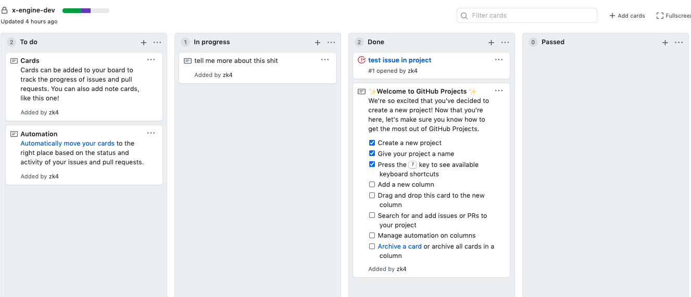
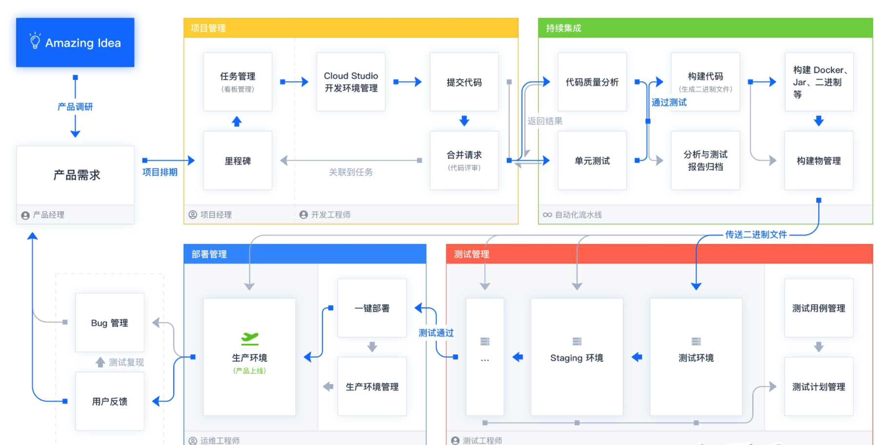
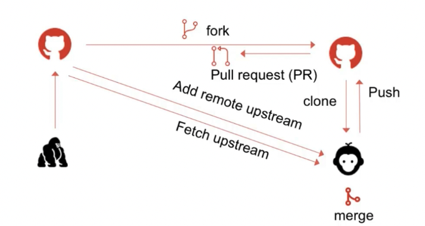

## 关于公司

### 现状

引擎现状

见 

业务现状

略

### 要做的

1. 引擎 
     1. 参与引擎设计. 
     2. 完善/整理 hybrid 前端框架 (iOS / android / h5).  
     3. 完善 hybrid 前端框架文档.
2. 业务
   1. 随甲方爸爸业务走

### 怎么做

#### 项目管理

基于 github 看板

https://github.com/zk4/x-engine/projects/2

 

 

#### CI 流程

#### 开发工具

- iOS

  - Xcode

- h5 

  - vs code
  - vim ?

- android 

  - android studio

  

#### 代码规范

遵循 eslint airbnb, 非业务逻辑类代码带测试.

#### git 流程

1. 提交本地: 尽快提交 git

2. 提交远程: 

   1. fork 远程仓库.
   2. 提交到 master 必须为完整功能.
   3. 使用 rebase 压缩成一个功能点 做 PR 提交

   

git 练习地址: https://learngitbranching.js.org/?demo=&locale=zh_CN

推荐 Mac 工具: https://git-fork.com/

#### 测试

- iphone  6+ 兼容 (UI, 引擎)
- android 5+ 兼容 (UI, 引擎)

### 资源管理

- 内部文档统一用 md.

### 例行事例

- 每日交流
- 隔天个人技术分享与介绍

## 关于个人

### 学习方法

- 先要明确自己要做什么. 而不是先学什么.
- 理解要做的事的基本流程. 所谓基本, 即本质. 不是某个框架, 某个包, 而是当你看到网络数据的交换时,  你应该对数据包如何在网络里传输有深刻了解. 当你看到加载脚本语言时, 你应该对脚本语言是如何工作在解释器里的机制要充分了解.
- 将流程里各节点用完备的开源解决方案,或自己的解决方案填满. 
- 如果解决方案是开源代码, 尽可能的看懂源码. 在空闲时间重新按照思路实现一遍.

达到这样一个目标: 任何一件事, 有思路 -> 能做 -> 能做好 ->  知识能沉淀

### 几点实操

- 构建自己的技术体系

  - 选择性积累: 要明确要积累哪些肌肉记忆的东西.不要啥都弄清个底朝天.

  - 快速调用: 你的技术栈在 n 年后还能非常快速的调用出来使用.

  - 定期复习: 要定时复习自己的技术栈, 不要再捡时又得从 0 开始.

    

- 拥抱命令行, 一键命令行化跟核心技术栈无关联的任何操作. 将一个点子到 demo 的时间差缩到最短.

  - 不要让搭环境这种东西拖后腿. 要理解环境.

比如: 做 npm 包这种事. 那么搭 npm 包环境要一键完成,  不要使用官方的生成方式, 官方生成方式步骤太多, 对思路有打断.

我们可以先理解官方的生成方式

- npm init    生成 package.json
- npm install 装各种包
- ...

在这个过程中, 去了解 package.json 里的组织形式. 

了解 node 怎么工作的. 模块怎么动作的. 等等. 直到你构建了一颗到达最底层的树. 可以停了.

在了解完所有这些, 以及文件的作用时, 将模板工程做成一个标准的文件夹放到你的技术栈文件夹. 写好 readme. 一键复制过来.

这样, 任何时候,你要做到在想做一个基于 node 的功能时, 能无脑的构建出一个 npm 包. 不会随着 npm 版本的变化而每次要了解一下新的工程构建方式. 

### 打怪里程碑

|                    |                                                              | 高级程序员 | 研发 leader | 技术总监 | 首席架构师 | CTO  |
| ------------------ | ------------------------------------------------------------ | ---------- | ----------- | -------- | ---------- | ---- |
| 业务               | 复杂功能实现设计,编码实现                                    | ✅          |             |          |            |      |
| 业务               | 疑难 bug 分析诊断,攻关                                       | ✅          |             |          |            |      |
| 业务               | 工作量评估,开发任务分配                                      |            | ✅           |          |            |      |
| 干好               | 代码审核,开发风险识别/报告/协调解决                          |            | ✅           |          |            |      |
| 技术               | 代码模板研发与推广、最佳实践规范总结与推广、自动化研发生产工具研发与推广 |            | ✅           |          |            |      |
| 干好               | 招聘面试、新人指导、领导复盘总结改进                         |            | ✅           |          |            |      |
| 产品平台           | 组建平台研发部，搭建公共技术平台，方便各条产品线开发。       |            |             | ✅        |            |      |
| 技术平台           | 通过技术平台、通过高一层的职权，管理和协调各个产品线组。     |            |             | ✅        |            |      |
| 平台架构           | 从功能性需求中识别出需要增加的非功能性需求，好满足性能、可扩展、解耦/集成、安全、可运维、高可用、易部署、易更新。并且识别完非功能型需求，还要做技术选型、技术架构风险识别、技术实现工作量评估 |            |             |          | ✅          |      |
| 架构设计与实现     | 非功能性模块的架构设计、接口设计、代码实现。所以需要的是有代码实现能力还要有架构思维的工程师，不需要画PPT的工程师 |            |             |          | ✅          |      |
| 业务架构设计与实现 | 需要对跨系统的接口进行识别、实现、维护，需要对能写成公共代码类库的进行分析、识别、接口设计、实现、变更维护。 |            |             |          | ✅          |      |
| 重构               | 架构师需要经常做Bug分析、非模板性和公共类库代码检查，以发现代码腐烂程度，以发现还有哪些代码没有做很好的架构与精心的代码设计。所以重构是经常性维护发生的，不是攒到某一刻动大手术，甚至推翻重做，那就不叫重构了。 |            |             |          | ✅          |      |
| 业绩达成           | 洞察客户需求，捕捉商业机会，规划技术产品，通过技术产品领导业务增长，有清晰的战略规划、主攻方向，带领团队实现组织目标 |            |             |          |            | ✅    |
| 前沿与平台         | 管理专门的团队做技术应用创新探索和前沿技术预研。 和技术平台团队、应用研发团队形成很好的联动作用，让创新原型试点能够很平滑的融入商业平台再让应用研发线规模化的使用起来。大量的前沿探索都死在了内部，做完试点就停滞了，这就需要CTO做好整体的衔接推动工作。 |            |             |          |            | ✅    |
| 研发过程管理       | 站在全局立场来端到端改进业务流程，为业务增长提供方便         |            |             |          |            | ✅    |
| 组织与人才建设     | 公司文化和价值观的传承；研发专业族团队梯队建制建设、研发管理族团队梯队建制建设；创建创新激发机制，激发研发人创新向前发展，激发黑马人脱颖而出 |            |             |          |            | ✅    |

 
