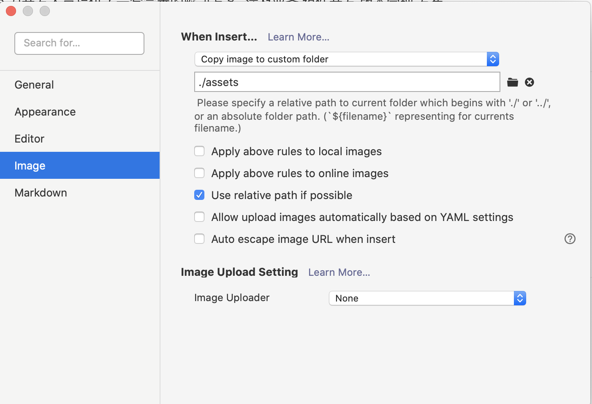
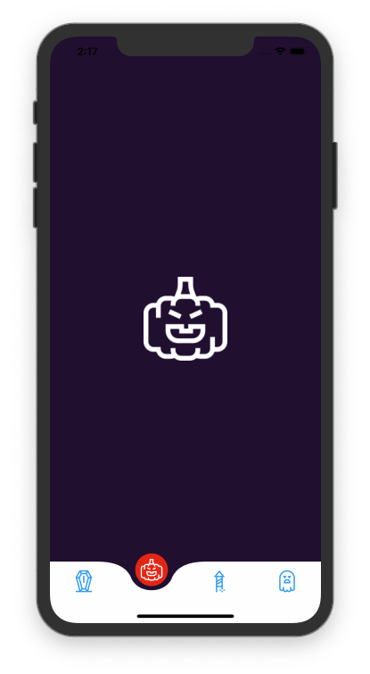
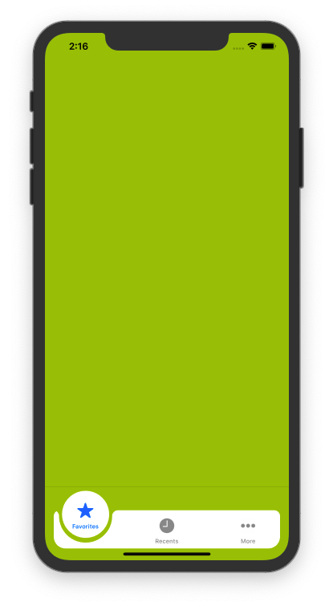

# 资源
-[SEIN.JS - 渐进式Web3D解决方案](https://github.com/hiloteam/Sein.js)

## typora 配置

## worktile
https://zktyfe.worktile.com/tasks/my

## vue to 小程序
https://max-team.github.io/Mars/

## 3d face 
https://3d-book-css.netlify.app/

## frame motion
https://www.framer.com/motion/

## agentwebveiw  for android 
对比一下 x5 
https://github.com/Justson/AgentWeb

## draw custom tabbar 
https://medium.com/@acerodstin/how-to-create-customised-tab-bar-for-ios-devices-7c89efaeac95

/Users/zk/git/hybrid-app/VBRRollingPit

/Users/zk/git/hybrid-app/AMTabView/AMTabView

保护 ios 不闪退 
https://github.com/jezzmemo/JJException
